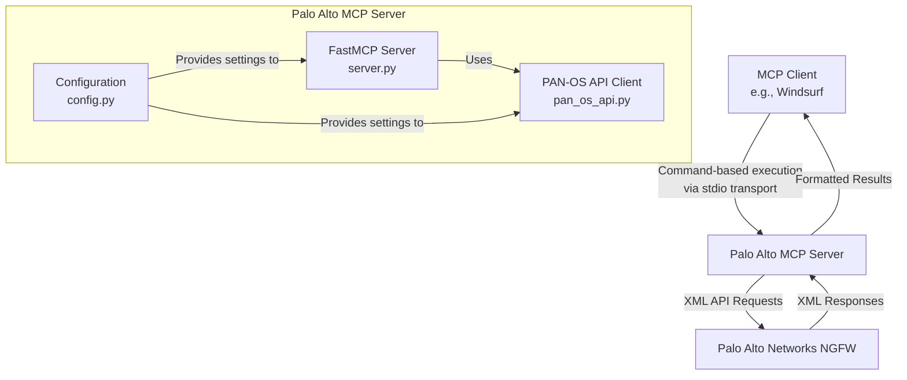
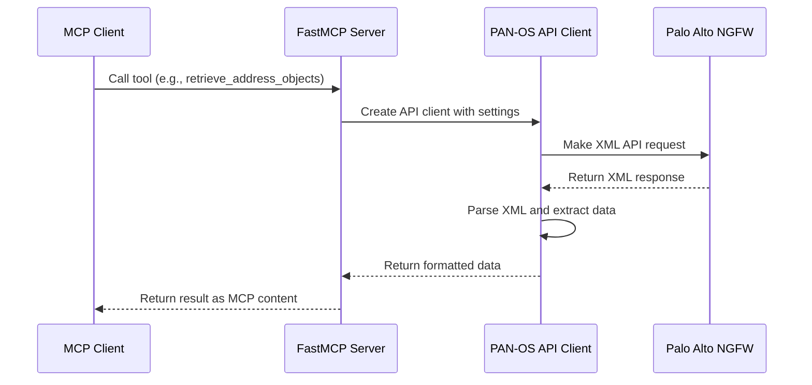

# Architecture

The Palo Alto Networks MCP Server is built using the `modelcontextprotocol` Python SDK, specifically leveraging the `FastMCP` abstraction. This document describes the architecture of the server and its components.

## Overall Architecture

## Components

### FastMCP Server (server.py)

The core of the application is the FastMCP server, which:

- Creates an instance of `FastMCP` from the `modelcontextprotocol` SDK
- Defines tool functions using the `@mcp.tool()` decorator
- Handles the conversion of tool results to MCP content types
- Manages the server lifecycle

### PAN-OS API Client (pan_os_api.py)

The PAN-OS API client is responsible for:

- Making asynchronous HTTP requests to the Palo Alto Networks XML API
- Parsing XML responses
- Extracting and formatting the relevant data
- Error handling and reporting

### Configuration (config.py)

The configuration module:

- Defines settings using `pydantic-settings`
- Loads configuration from environment variables
- Provides validation for required settings
- Offers helpful error messages for missing or invalid configuration

## Request Flow

## Data Flow

1. The MCP client (e.g., Windsurf) invokes a tool on the server
2. The server loads configuration from environment variables
3. The server creates an instance of the PAN-OS API client
4. The API client makes an asynchronous HTTP request to the firewall
5. The firewall responds with XML data
6. The API client parses the XML and extracts the relevant information
7. The API client returns the formatted data to the server
8. The server returns the data to the client as MCP content

## Error Handling

The server implements comprehensive error handling:

- Configuration errors are caught during server startup
- HTTP errors are caught and reported with meaningful messages
- XML parsing errors are caught and reported
- API errors (e.g., authentication failures) are caught and reported
- Unexpected errors are caught and logged

## Security Considerations

- API keys are loaded from environment variables, not hardcoded
- HTTPS is used for communication with the firewall
- Error messages are sanitized to avoid leaking sensitive information
- The server runs with the minimum required permissions

## MCP Server Endpoints

!!! note
    The MCP server must use a specific pattern for SSE endpoints to work correctly with the Windsurf client:

    1. The main SSE connection endpoint should be at `/sse`
    2. The message endpoint for SSE transport should be at `/messages/` (not `/sse-messages/`)
    3. Both the server configuration and the client's `mcp_config.json` must align on these paths

This pattern follows the PRD specification and is required for proper communication between the client and server.
