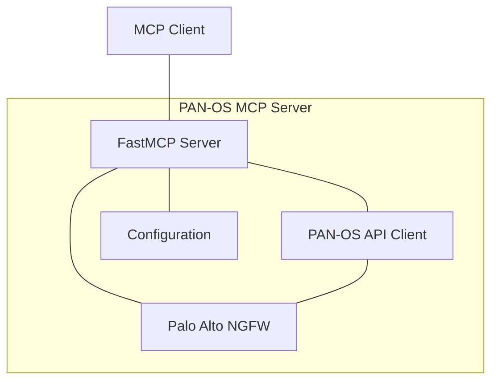
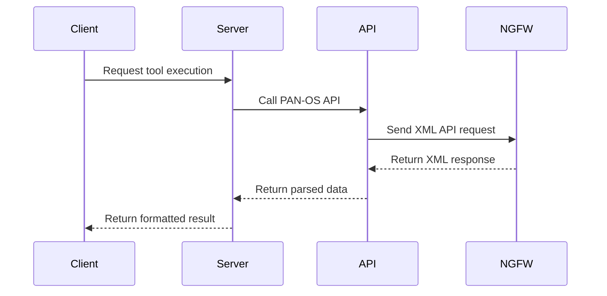
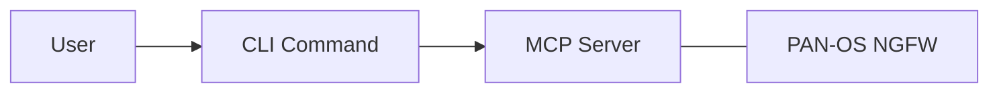
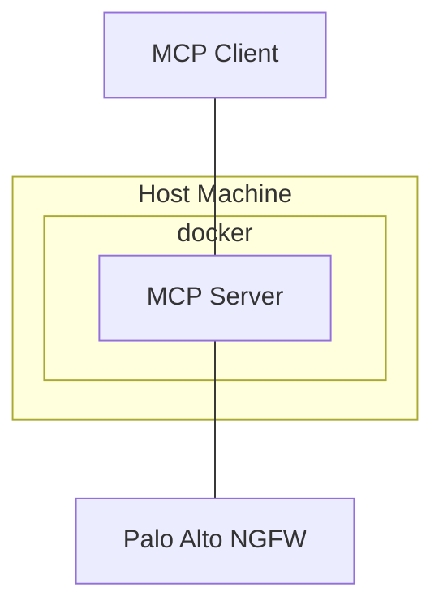
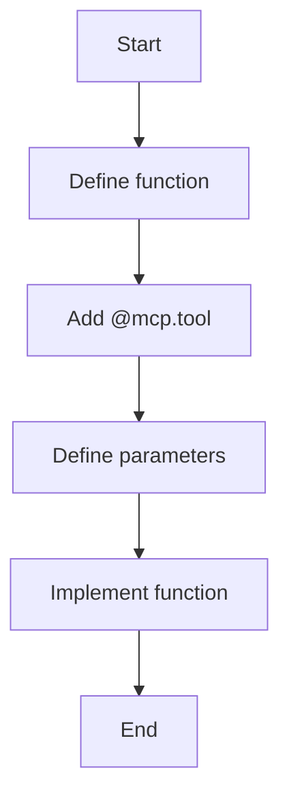
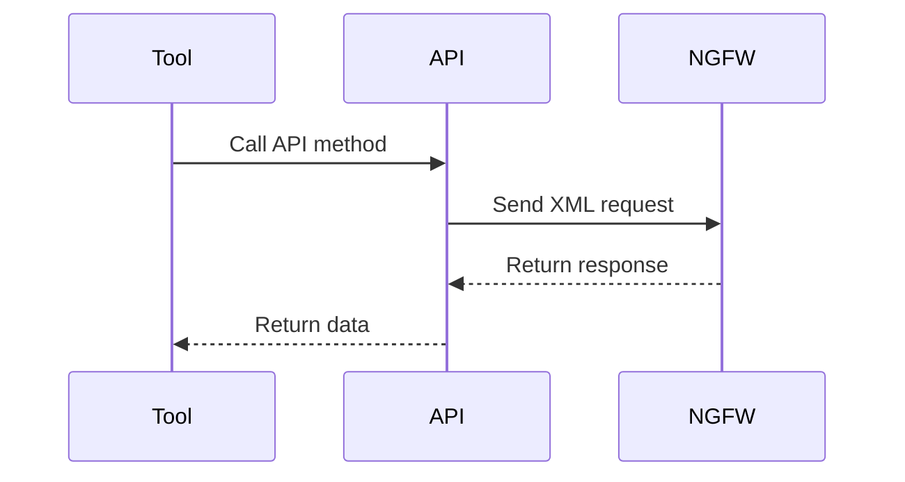
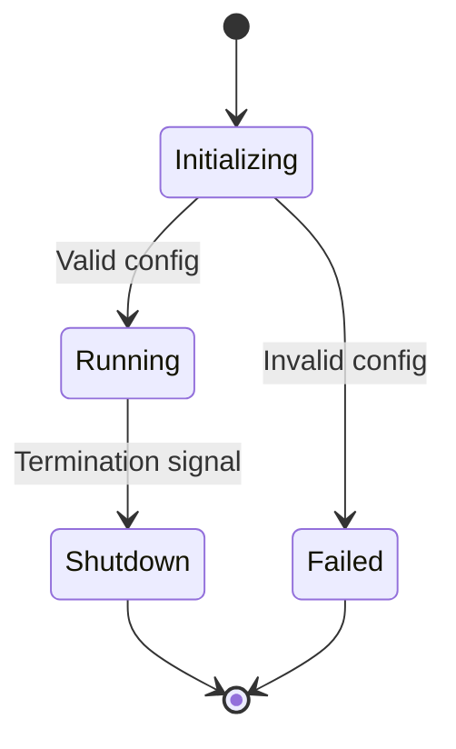
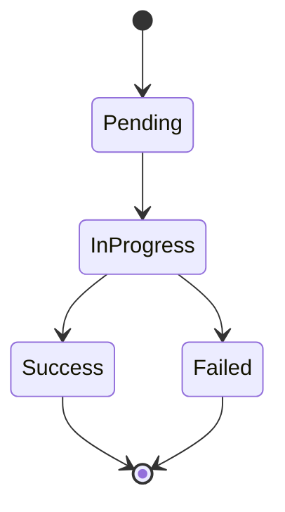
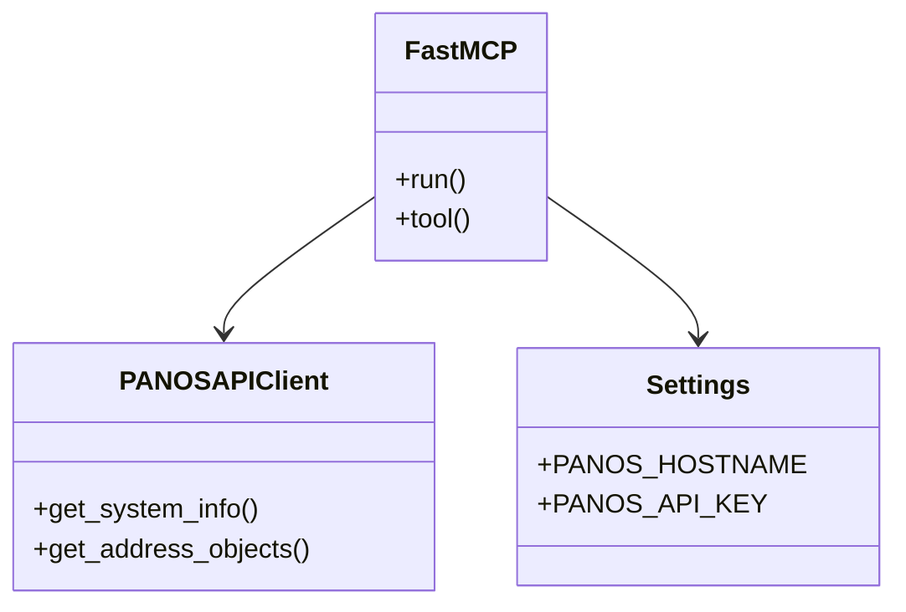

# Mermaid Diagram Examples

This page contains examples of diagrams and charts that can be created using mermaid for the PAN-OS MCP Server documentation.

## Architecture Diagrams

### MCP Server Architecture

### Communication Flow

## Deployment Diagrams

### Standard Deployment

### Container Deployment

## Process Flows

### Tool Registration Process

### API Request Handling

## State Diagrams

### MCP Server Lifecycle

### API Request States

## Class Diagrams

### MCP Server Components

