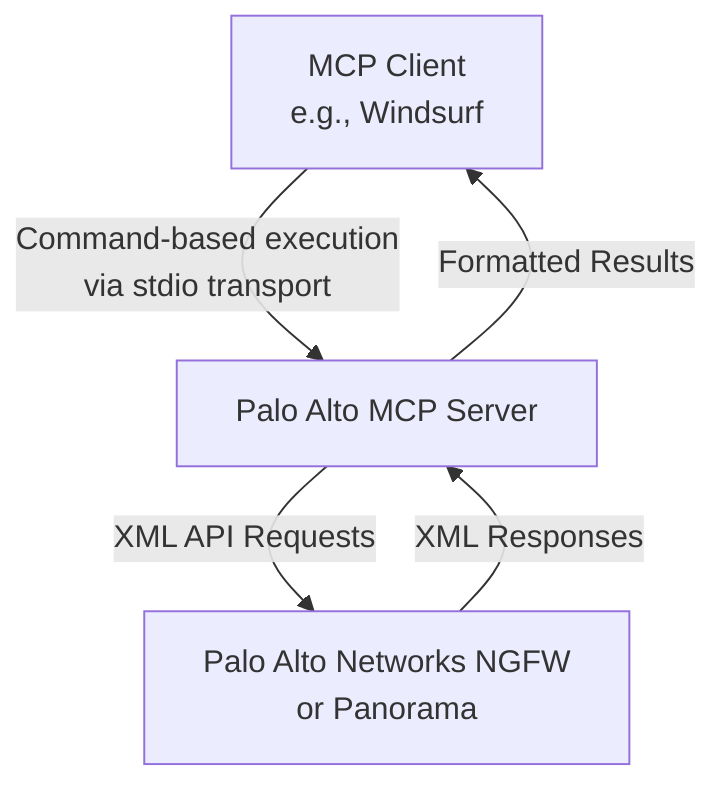

# Palo Alto Networks MCP Server

A Model Context Protocol (MCP) server that interfaces with Palo Alto Networks Next-Generation Firewalls (NGFW) and Panorama via their XML API. This server enables MCP clients (like Windsurf) to retrieve firewall and Panorama configuration data.

## Key Features

- Built using the `modelcontextprotocol` Python SDK with the `FastMCP` abstraction
- Provides tools for retrieving firewall and Panorama configuration data:
  - System information
  - Address objects (with support for Panorama device groups)
  - Security zones
  - Security policies
- Packaged as a standard Python module installable via `pip` or `uv`
- Configurable via environment variables
- Supports command-based execution via standard I/O transport

## Quick Links

- [Installation](guide/installation.md)
- [Configuration](guide/configuration.md)
- [Basic Usage](guide/usage.md)
- [Architecture](architecture.md)

## System Architecture

